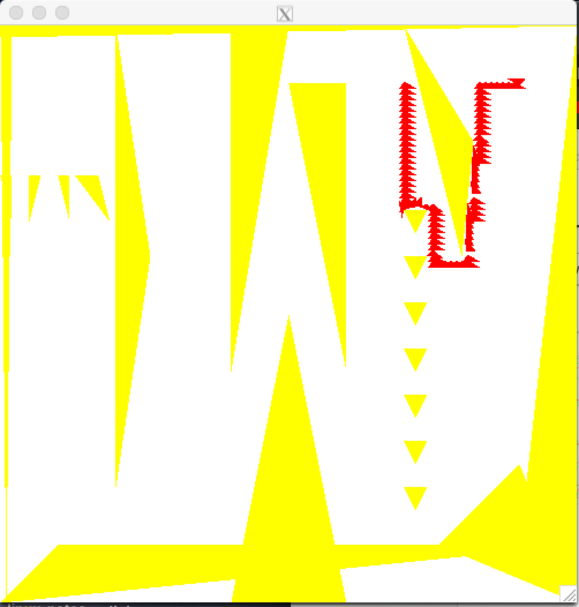

## Language Use For This Project
The implementation of this code was done using C/C++ libraries on Mac PC.
the libraries Xlib library was used from XQuatz from linux.
## Instruction to run in the terminal.
```bash
//Step 1 g++ motion_planning.cpp -o motion_planning -lX11 -lm -L/usr/X11R6/lib
//Step 2 ./motion_planning data.txt
```
## Data Txt File
The data.txt file contains vehicle shape 
- V (x1,y1)(x2,y2)(x3,y3) vehicle dimentions
- S (x,y) start position 
- T (x,y) target position 
- O (x1,y1)(x2,y2)(x3,y3) obstacle shapes
## Vehicle Functionalities
The vehicle: can move to left, riht, up,down, and counter clockwire rotation.
Node that the veicule should move and rotate in that order, so that it does rotate in circles.
## Test1

## Test2

